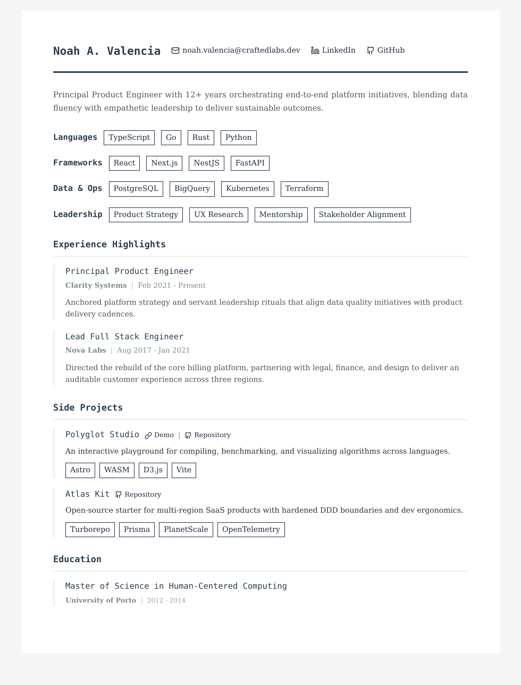
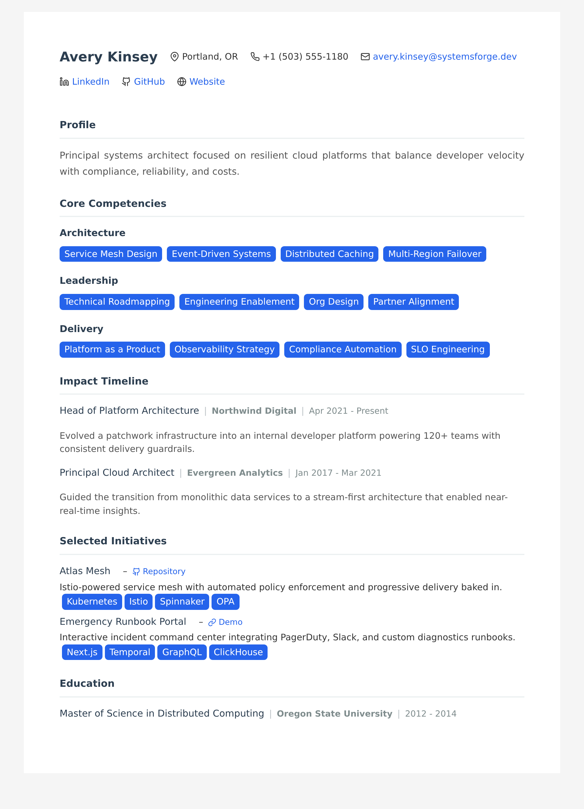
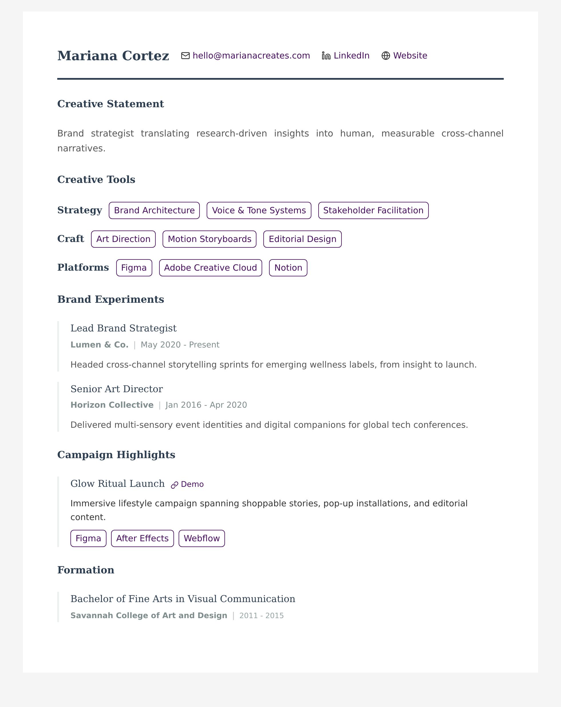
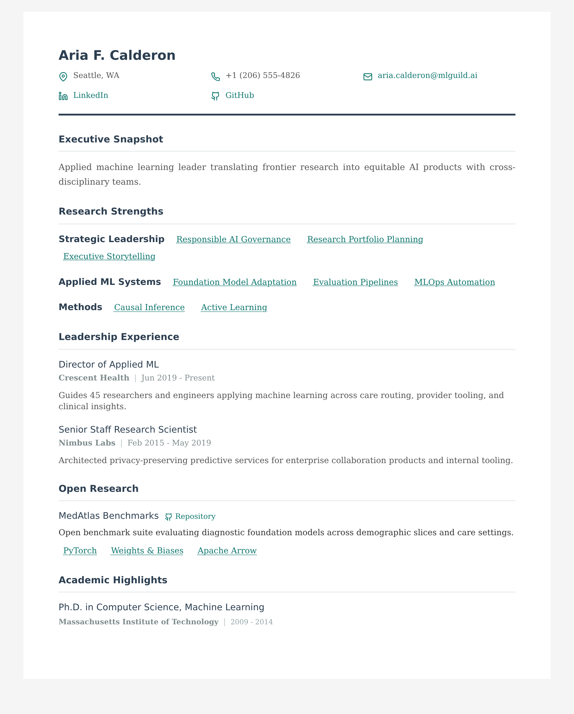

# Cvault

[](https://www.npmjs.com/package/cvault)
[](https://opensource.org/licenses/MIT)
[](https://www.typescriptlang.org/)
[](https://nodejs.org/)
[](https://github.com/ericmiguel/cvault)
[](https://github.com/prettier/prettier)

I don't always need a PDF resume, but I never have a Vim-ready one when I do (lol). YAML > MS Word.

## 📦 Installation

```bash
# Install globally
npm install -g cvault

# Or use with npx (no installation required)
npx cvault build my-resume.yaml -p my-resume.pdf
```

## 🚀 Quick Start

1. Copy one of the sample [templates from the repository](https://github.com/ericmiguel/cvault/tree/main/static/templates)
2. Edit your resume YAML file with your information
3. Generate HTML and PDF `cvault build my-resume.yaml -p my-resume.pdf`
4. Save your YAML resume into a Git repo and try to stop losing it!

## 📄 Templates & Customization

You can find sample YAML models under `static/templates/` covering different styles and audiences.

|  |  |  |  |
| ------------------------------------------------------------------------------- | ----------------------------------------------------------------------- | ------------------------------------------------------------------------- | ----------------------------------------------------- |

1. **[Minimalist Software Engineer](static/templates/minimalist-software-engineer.yaml)** – Feature-rich baseline with every customization enabled.
2. **[Modern Systems Architect](static/templates/modern-systems-architect.yaml)** – Sleek platform-engineering layout with compact spacing and inline contact header.
3. **[Creative Brand Strategist](static/templates/creative-brand-strategist.yaml)** – Expressive creative profile with stacked contact info and outlined badges.
4. **[Applied ML Lead](static/templates/applied-ml-lead.yaml)** – Research-forward leadership résumé using link-style badges and dense line spacing.

See the **[Customization Guide](CUSTOMIZATION.md)** for complete reference on all styling options, including page breaks, line spacing, etc.

### Advanced Options

```bash
# Choose paper format (A4 or Letter)
cvault build resume.yaml -p resume.pdf --format Letter

# Disable background colors (for printing)
cvault build resume.yaml -p resume.pdf --no-background

# Specify custom output paths
cvault build resume.yaml -h output/resume.html -p output/resume.pdf

# Select a template
cvault build resume.yaml -p resume.pdf --template compact

# Generate only HTML (no PDF) - advanced use case
cvault html resume.yaml -o resume.html

# Convert existing HTML to PDF - advanced use case
cvault pdf resume.html -o resume.pdf --format Letter
```

## 💻 Development

### Setup

```bash
# 1. Clone the repository
git clone https://github.com/ericmiguel/cvault.git && cd cvault

# 2. Install dependencies
npm install

# 3. Copy one of the sample templates
cp static/templates/minimalist-software-engineer.yaml my-resume.yaml

# 4. Generate HTML and PDF
npm run dev -- build my-resume.yaml -p my-resume.pdf
```

### Scripts

```bash
# Build
npm run build                                             # Compile TypeScript and copy assets

# Development
npm run dev -- build my-resume.yaml -p my-resume.pdf      # Run CLI in dev mode
npm run generate:all                                      # Generate all template examples (HTML + PDF)
npm run generate:all:pdf                                  # Generate only PDFs for all templates
npm run generate:all:html                                 # Generate only HTML files for all templates
npm run generate:previews                                 # Refresh README preview images

# Code Quality
npm run check                                             # Run all checks (format, lint, type-check)
npm run format                                            # Format code with Prettier
npm run format:check                                      # Check code formatting
npm run lint                                              # Lint code with ESLint
npm run lint:fix                                          # Auto-fix linting issues
npm run type-check                                        # TypeScript type checking

# Tests
npm test                                                  # Run all tests once
npm run test:watch                                        # Run tests in watch mode
npm run test:ui                                           # Run tests with UI
npm run test:coverage                                     # Run tests with coverage report
```

## 🤝 Contributing

Feel free to open issues or pull requests with improvements!
